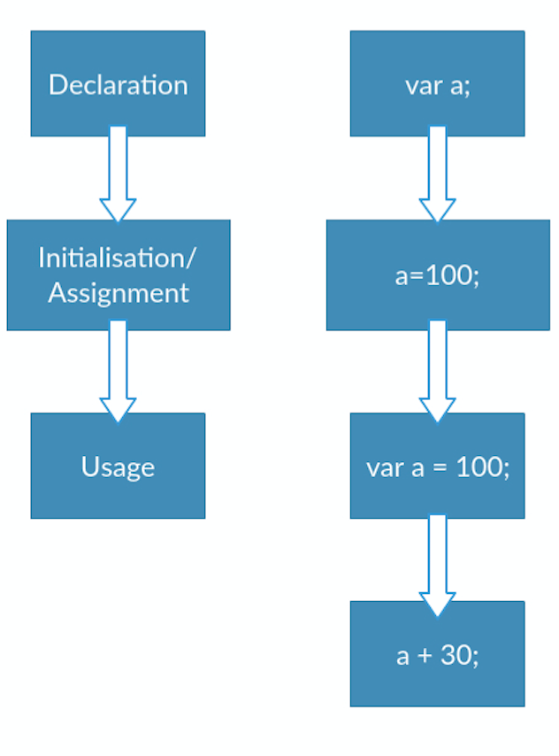
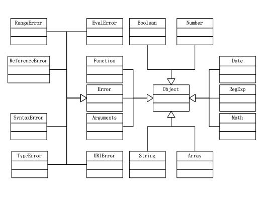
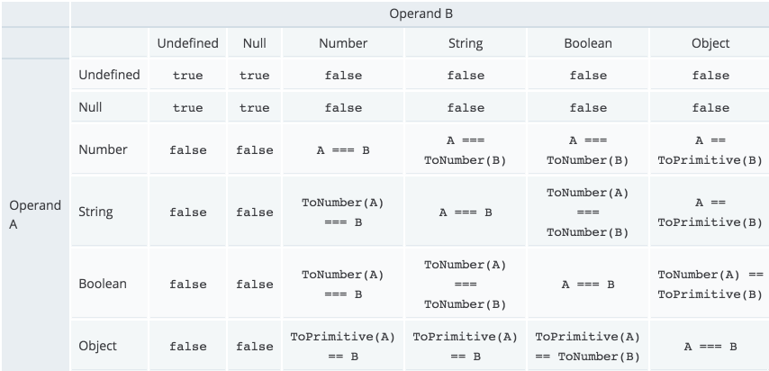

## Can you name two programming paradigms important for JavaScript app developers.
JavaScript is a multi-paradigm language, supporting **imperative/procedural** programming along with **OOP** (Object-Oriented Programming) and **functional programming**. JavaScript supports OOP with **prototypal inheritance**.

## Explain event delegation
Event propagation and bubbling :(http://javascript.info/bubbling-and-capturing)
Event delegation allows you to avoid adding event listeners to specific nodes. Instead, the event listener is added to one parent.

```javascript
<ul id="parent-list">
<li id="post-1">Item 1</li>
<li id="post-2">Item 2</li>
<li id="post-3">Item 3</li>
<li id="post-4">Item 4</li>
<li id="post-5">Item 5</li>
<li id="post-6">Item 6</li>
</ul>
```

When we need to add a click listener to each child element.
You could add an event listener to the parent `UL` element. When the event listener is triggered, check the event element to ensure it's type of element to react to.If it is an LI element, we have what we need!  If it's not an element that we want, the event can be ignored.Using the Element.matches API, we can see if the element matches our desired target.
In summary, the steps of event delegation are:
 - Add an event listener on some element enclosing all the elements where you want to simulate event handling (BODY)
 - In the handler, simulate bubbling and look for matching elements (all A tags)
 - When you find a matching element, set event.currentTarget to it and call subsequent handling code

The standard DOM Events describes 3 phases of event propagation:   
- Capture: When you clicked, browser knows a click event occurred. It starts from the window (lowest level/root of your website), then goes to document, then html root tag, then body, then table... its trying to reach the the as lowest level of element as possible. This is called capture phase (phase-1).
- Target: When browser reach the lowest level of element. In this case, you have clicked on a table cell (table data) hence target would be "td" tag. Then browser checks whether you have any click handler attached to this element. If there is any, browser executes that click hander. This is called target phase (phase-2).
- Bubbling: After firing click hander attached to "td", browser walks toward root. One level upward and check whether there is any click handler attached with table row ("tr" element). If there is any it will execute that. Then it goes to tbody, table, body, html, document, window. In this stage its moving upward and this is called event bubbling or bubbling phase (phase-3). Please note that, you clicked on cell but all the event handler with parent elements will be fired. This is actually very powerful (check event delegation)  

#### Event Bubbling
 When an event happens on an element, it first runs the handlers on it, then on its parent, then all the way up on other ancestors.
 below are 3 nested elements FORM > DIV > P with a handler on each of them:

  ``` javascript
   <style>
    body * {
      margin: 10px;
      border: 1px solid blue;
    }
  </style>

  <form onclick="alert('form')">FORM
    <div onclick="alert('div')">DIV
      <p onclick="alert('p')">P</p>
    </div>
  </form>
  ```

So if we click on `<p>`, then we’ll see 3 alerts: p → div → form.
The process is called 'bubbling', because events “bubble” from the inner element up through parents like a bubble in the water.
#### event.target
A handler on a parent element can always get the details about where it actually happened.The most deeply nested element that caused the event is called a target element, accessible as event.target.

#### Event Capturing
There’s another phase of event processing called “capturing”. It is rarely used in real code, but sometimes can be useful.


## Explain how this works in JavaScript
`This` refers to itself, to its won object or global object.Using `this` are partitioned in 3 locations of code:
- In Functions:  `this` is an extra, often implicit, parameter.
  * Real functions ->  `this` is the global object in sloppy mode, undefined in strict mode
    ``` javascript
    sloppy mode:
    function sloppyFunc() {
            console.log(this === window); // true
    }
    sloppyFunc();
    strict mode:
    function strictFunc() {
            'use strict';
            console.log(this === undefined); // true
      }
      strictFunc();
    ```
  * Constructors -> `this` refers to the newly created instance
    ``` javascript
    var savedThis;
        function Constr() {
            savedThis = this;
        }
        var inst = new Constr();
        console.log(savedThis === inst); // true
      ```
  * Methods -> `this` refers to the receiver of the method call
    ``` javascript
      var obj = {
            method: function () {
                console.log(this === obj); // true
            }
        }
        obj.method();
      ```
-  in Outside functions ( in the top-level scope)  
`This` refers to the global object in browsers and to a module's exports in Node.js
-  in eval()  
eval is a function which evaluates a string as though it were an expression and returns a result
  `This` refers to the receiver of the method call
    * if `eval()` is called indirectly, `this` refers to the global object
    * if `eval()` is called directly, `this` remains the same as in surroundings of `eval()`.

## Explain how prototypal inheritance works
```JavaScript
function Rectangle(width, height) {
  this.width = width;
  this.height = height;
}
Rectangle.prototype.area = function() {
  return this.width * this.height;
}
function Square(length) {
  this.width = this.height = length;
}
Square.prototype = Object.create(Rectangle.prototype);
var square = new Square(4);
console.log(square.area());
```

## What do you think of AMD vs CommonJS vs ES6?
Asynchronous Module Definition (AMD) was born out of a group of developers that were displeased with the direction adopted by CommonJS. In fact, AMD was split from CommonJS early in its development. The main difference between AMD and CommonJS lies in its support for asynchronous module loading.
- PROS
  - Asynchronous loading (better startup times).
  - Circular dependencies are supported.
  - Compatibility for require and exports.
  - Dependency management fully integrated.
  - Modules can be split in multiple files if necessary.
  - Constructor functions are supported.
  - Plugin support (custom loading steps).
- CONS
  - Slightly more complex syntactically.
  - Loader libraries are required unless transpiled.
  - Hard to analyze for static code analyzers.
- Implementations
  - require.js and Dojo.

CommonJS modules were designed with server development in mind. Naturally, the API is synchronous. In other words, modules are loaded at the moment and in the order they are required inside a source file.
- PROS
  - Simple: a developer can grasp the concept without looking at the docs.
  - Dependency management is integrated: modules require other modules and get loaded in the needed order.
  - require can be called anywhere: modules can be loaded programmatically.
  - Circular dependencies are supported.
- CONS
  - Synchronous API makes it not suitable for certain uses (client-side).
  - One file per module.
  - Browsers require a loader library or transpiling.
  - No constructor function for modules (Node supports this though).
  - Hard to analyze for static code analyzers.
- Implementations
  - NodeJS.
  - For the client there are currently two popular options: webpack and browserify.

ES6
- PROS
  - Synchronous and asynchronous loading supported.
  - Syntactically simple.
  - Support for static analysis tools.
  - Integrated in the language (eventually supported everywhere, no need for libraries).
  - Circular dependencies supported.
- CONS
  - Still not supported everywhere.

## Explain why the following doesn't work as an IIFE: `function foo(){ }();`? What needs to be changed to properly make it an IIFE?
- #### What is Immediately Invoked Function Expressions(IIFE)
An IIFE is an anonymous function that is created and then immediately invoked. It’s not called from anywhere else, but runs just after being created.   
Example:
```
(function () {
  console.log(5);
} ());
```
- #### Why we need IIFE
The primary reason to use an IIFE is to obtain data privacy. Because JavaScript's var scopes variables to their containing function, any variables declared within the IIFE cannot be accessed by the outside world.
``` javascript
(function () {
    var foo = "bar";
    console.log(foo);// Outputs: "bar"
})();
// ReferenceError: foo is not defined
console.log(foo);
```
- #### Pass arguments into the IIFE:
``` javascript
var foo = "foo";
(function (innerFoo) {
    console.log(innerFoo);// Outputs: "foo"
})(foo);
```

- #### Explain why the following doesn't work as an IIFE:
`function foo(){ }();`
because this function is defined with Normal function definition and not been called. To change it as an IIFE,
``` javascript
(function foo(){
  ...
}()); // returns ... immediately
```

## What's the difference between a variable that is: null, undefined or undeclared?
- `undefined`: A variable is undefined when it hasn't been defined yet. If you call a variable or function without having actually created it yet, the parser will give you an `not defined` error.
  ``` javascript
  var undefinedVariable;
  console.log(typeof(undefinedVariable)); // undefined
  ```
  To assign a value to the variable, use the equal sign:
  ``` javascript
  var numberVariable = 1;
  console.log(numberVariable); // 1
  ```

- `null`: A variable is null when it is defined and have null assigned to them.
  ``` javascript
  var nullVariable = null; // null
  typeof nullVariable // "object"
  ```

  When will following functions evaluate:
  ``` javascript
  if( value ) {
  }
  ```
  Value will evaluate to true if value is not: null /undefined / NaN/ empty string ("")/ 0/ false

- `undeclared`: A variable is undeclared when it does not sue the `var` keyword. undeclared variables do not exist until code assigning them is executed. Therefore, assigning a value to an undeclared variable implicitly creates it as a global variable when the assignment is executed. This means that, all undeclared variables are global variables.   

```javascript
  function hoist() {
    a = 20;
    var b = 100;
  }
  hoist();
  console.log(a);
  /*
  Accessible as a global variable outside hoist() function
  Output: 20
  */

  console.log(b);
  /*
  Since it was declared, it is confined to the hoist() function scope.
  We can't print it out outside the confines of the hoist() function.
  Output: ReferenceError: b is not defined
  */
```

## What is a closure, and how/why would you use one?
Closure is a function that captures the state of the surrounding environment(variables that are used locally, but defined in an enclosing scope). In other words, a function has access to variables declared outside of its scope
```javascript
function f1(){
  var n=999;
　function f2(){
　　　alert(n);
　}
　return f2;
}
var result=f1();
result(); // 999
```
Disadvantage: As long as closures are active, this memory cannot be garbage collected. Therefore, closures can lead to memory leaks if not used well.

## What's a typical use case for anonymous functions?
- #### what's anonymous functions?  
  An anonymous function is a function that was declared without any named identifier to refer to it. As such, an anonymous function is usually not accessible after its initial creation.
  - Normal function definition:
  ``` javaScript
  function hello() {
    alert('Hello world');
  }
  hello();
  ```
  - Anonymous function definition:
  ``` javaScript
  var anon = function() {
    alert('I am anonymous');
  };
  anon();
  ```
- #### What's a typical use case for anonymous functions?  
One common use for anonymous functions is as arguments to other functions. Another common use is as a closure.   
example:
``` javascript
   function takesACallback(callback) {
    return "The callback says: " + callback();
   }

  takesACallback(function() {
      return "I'm the callback!";
    }); // returns "The callback says: I'm the callback!"
 ```

## What's the difference between host objects and native objects?
- #### What's native object
    > Native objects are inherent to JS - they are available to you so long as you're using JS. The native objects are sometimes referred to as “global objects” since they are the objects that JavaScript has made natively available for use.  
    Below find the list of 9 native object constructors that come pre-packaged with JavaScript:  
    ✴ Number() ✴ String() ✴ Boolean() ✴ Object() ✴ Array() ✴ Function() ✴ Date() ✴ RegExp() ✴ Error()

- #### What's host object  
  >Host object includes Everything the environment gives you. Host objects can differ by environment (or host).   
  Example, browser environment supplies objects such as window. While a node.js/server environment supplies objects such as NodeList.

## Difference between: `function Person(){}, var person = Person()`, and `var person = new Person()`?
`var person = Person()` is calling function `Person` and set the result to variable `person`;
`var person = new Person()` is creating an instance of `Person`.

## What's the difference between .call and .apply?
The difference between call and apply. Both can be called on functions, which they run in the context of the first argument. In call the subsequent arguments are passed in to the function as they are, while apply expects the second argument to be an array that it unpacks as arguments for the called function.

While the syntax of this function is almost identical to that of call(), the fundamental difference is that call() accepts an argument list, while apply() accepts a single array of arguments.

```JavaScript

.apply(thisArg, [argsArray])
.call(thisArg, arg1, arg2, ...)


var person1 = {name: 'Marvin', age: 42, size: '2xM'};
var person2 = {name: 'Zaphod', age: 4200, size: '1xS'};

var sayHello = function(){
    alert('Hello, ' + this.name);
};

var sayGoodbye = function(){
    alert('Goodbye, ' + this.name);
};

sayHello.call(person1);
sayHello.apply(person1);

sayGoodbye.call(person2);
sayGoodbye.apply(person2);
```

## Explain Function.prototype.bind.
## When would you use document.write()?
```javascript
<script type="text/javascript">
document.write("<h1>Test comment！</h1>");
</script>
```
>mostly works like alert function

- Definition and Usage

The write() method writes HTML expressions or JavaScript code to a document.

The write() method is mostly used for testing: If it is used after an HTML document is fully loaded, it will delete all existing HTML.

Note: When this method is not used for testing, it is often used to write some text to an output stream opened by the document.open() method.

It also can be used in initialize a new window with document.close().

```JavaScript
<script language="JavaScript">
  var newWindow
  function makeNewWindow(){
    newWindow = window.open("","","status,height=200,width=300")
  }

  function subWrite(){
    // make new window if someone has closed it
    if(newWindow.closed){
      makeNewWindow()
    }
    // bring subwindow to front
    newWindow.focus()
    // assemble content for new window
    var newContent = "<html><head><title>A New Doc</title></head>"
    newContent += "<body bgcolor='coral'><h1>This document is brand new.</h1>"
    newContent += "</body></html>"
    // write HTML to new window document
    newWindow.document.write(newContent)
    newWindow.document.close()    // close layout stream
  }
</script>
</head>

<body onLoad="makeNewWindow()">
  <form>
    <input type="button" value="Write to Subwindow" onClick="subWrite()">
  </form>
</body>
```

## What's the difference between feature detection, feature inference, and using the UA string?
Feature detection checks a feature for existence, e.g.:
```JavaScript
if (window.XMLHttpRequest) {
    new XMLHttpRequest();
}
```
Feature inference checks for a feature just like feature detection, but uses another function because it assumes it will also exist, e.g.:
```JavaScript
if (document.getElementsByTagName) {
    element = document.getElementById(id);
}
```
Checking the UA string is an old practice and should not be used anymore. Serving different Web pages or services to different browsers is usually a bad idea. The Web is meant to be accessible to everyone, regardless of which browser or device they're using. There are ways to develop your website to progressively enhance itself based on the availability of features rather than by targeting specific browsers. e.g.:
```JavaScript
if (navigator.userAgent.indexOf("MSIE 7") > -1){
    //do something
}
```

## Explain Ajax in as much detail as possible. What are the advantages and disadvantages of using Ajax?
AJAX = Asynchronous JavaScript And XML.

AJAX is not a programming language.

The two major features of AJAX allow you to do the following:

Make requests to the server without reloading the page
Receive and work with data from the server

you can:

Update a web page without reloading the page
Request data from a server - after the page has loaded
Receive data from a server - after the page has loaded
Send data to a server - in the background

  

 What are the advantages and disadvantages of using Ajax?

 * Advantages

 >Better interactivity

 This is pretty much the most striking benefit behind why several developers and webmasters are switching to AJAX for their websites. AJAX allows easier and quicker interaction between user and website as pages are not reloaded for content to be displayed.

 >Easier navigation

 AJAX applications on websites can be built to allow easier navigation to users in comparison to using the traditional back and forward button on a browser.

 >Compact

 With AJAX, several multi purpose applications and features can be handled using a single web page, avoiding the need for clutter with several web pages. For our use of AJAX on goedkope-zomervakantie.com, it took just a few lines of code!

 >Backed by reputed brands

 Another assuring reason to use AJAX on your websites is the fact that several complex web applications are handled using AJAX, Google Maps is the most impressive and obvious example, other powerful, popular scripts such as the vBulletin forum software has also incorporated AJAX into their latest version.

 * Disadvantages

 >The back and refresh button are rendered useless

 With AJAX, as all functions are loaded on a dynamic page without the page being reloaded or more importantly a URL being changed (except for a hash symbol maybe), clicking the back or refresh button would take you to an entirely different web page or to the beginning of what your dynamic web page was processing. This is the main drawback behind AJAX but fortunately with good programming skills this issue can be fixed.  

 twitter solution

 >It is built on javascript

 While javascript is secure and has been heavily used by websites for a long period of time, a percentage of website surfers prefer to turn javascript functionality off on their browser rendering the AJAX application useless, a work around to this con is present as well, where the developer will need to code a parallel non-javascript version of the dynamic web page to cater to these users.

## Explain how JSONP works (and how it's not really Ajax).
You’ll be disappointed to hear that the new-and-exciting technology that is fundamental to JSONP is nothing more than the bog-standard `<script>` tag.

The difference between a JSON response and a JSONP response, is that the JSONP response is formulated such that the response object is passed as an argument to a callback function.

JSON:
```javascript
{
    "bar": "baz"
}
```
JSONP:
```javascript
foo({
    "bar": "baz"
});
```
This is why you see JSONP requests containing the "callback" parameter; so the server knows the name of the function to wrap the response around.

This function must exist in the global scope at the time the `<script>` tag is evaluated by the browser (once the request has completed).

* Same-origin policy
The same-origin policy restricts how a document or script loaded from one origin can interact with a resource from another origin. It is a critical security mechanism for isolating potentially malicious documents.


* Definition of an origin
Two pages have the same origin if the protocol, port (if one is specified), and host are the same for both pages. The following table gives examples of origin comparisons to the URL http://store.company.com/dir/page.html:  

<table>
    <tr>
        <td>URL</td>
        <td>Outcome</td>
        <td>Reason</td>
    </tr>
    <tr>
        <td>http://store.company.com/dir2/other.html</td>
        <td>Success</td>
        <td></td>
    </tr>
    <tr>
        <td>http://store.company.com/dir/inner/another.html</td>
        <td>Success</td>
        <td></td>
    </tr>
    <tr>
        <td>https://store.company.com/secure.html</td>
        <td>Failure</td>
        <td>Different protocol</td>
    </tr>
    <tr>
        <td>http://store.company.com:81/dir/etc.html</td>
        <td>Failure</td>
        <td>Different port</td>
    </tr>
    <tr>
        <td>http://news.company.com/dir/other.html</td>
        <td>Failure</td>
        <td>Different host</td>
    </tr>
</table>

## Have you ever used JavaScript templating? If so, what libraries have you used?
JavaScript templating refers to the client side data binding method implemented with the JavaScript language. This approach became popular thanks to JavaScript's increased use, its increase in client processing capabilities, and the trend to outsource computations to the client's web browser. Popular JavaScript templating libraries are `AngularJS`, `Backbone.js`, `Ember.js`, `Handlebars.js`, `Vue.js` and `Mustache.js`. A frequent practice is to use double curly brackets (i.e. {{key}}) to call values of the given key from data files, often JSON objects.

Normally, the js code is like:
```JavaScript
var html='<ul>';
for(var i=0;i<users.length;i++){
  html+='<li><a href=">'+users[i].url+'">'+users[i].name+'</a>';
}
html+='</ul>';

document.getElementById('results').innerHTML=html;
```
It works like this:
```JavaScript
<ul>
    <% for ( var i = 0; i < users.length; i++ ) { %>
         <li><a href="<%=users[i].url%>"><%=users[i].name%></a></li>
    <% } %>
</ul>
```

This is what we want:
```JavaScript
<ul>
  <li><a href="XXX">OOO</a></li>
  <li><a href="XXX">OOO</a></li>
  <li><a href="XXX">OOO</a></li>
</ul>
```

## Explain "hoisting".
The following is the JavaScript lifecycle and indicative of the sequence in which variable declaration and initialization occurs.It is however important to remember that in the background, JavaScript is religiously declaring then initializing our variables.All variable and function declarations are hoisted to the top of their scope.

  

``` javascript
console.log(hoist); // Output: undefined
var hoist = 'The variable has been hoisted.';
```
JavaScript engine interprets code as:
``` javascript
var hoist;

console.log(hoist); // Output: undefined
hoist = 'The variable has been hoisted.';
```
Because of this, we can use variables before we declare them. However, we have to be careful because the hoisted variable is initialized with a value of undefined. The best option would be to declare and initialize our variable before use.

One case where this is particularly likely to bite new JavaScript developers is when reusing variable names between an inner and outer scope. For example:

```JavaScript
var name = "Baggins";

(function () {
    // Outputs: "Original name was undefined"
    console.log("Original name was " + name);

    var name = "Underhill";

    // Outputs: "New name is Underhill"
    console.log("New name is " + name);
})();
```

- #### Function Hoisting  
  As we mentioned before, all variable and function declarations are hoisted to the top of their scope. Since this is one of the eccentricities of how JavaScript handles variables, it is recommended to always declare variables regardless of whether they are in a function or global scope.
  ```javascript
    // Outputs: "Yes!"
  isItHoisted();

  function isItHoisted() {
      console.log("Yes!");
  }
  ```
  However, **function definition hoisting only occurs for function declarations, not function expressions.** For example:
  ```JavaScript
  // Outputs: "Definition hoisted!"
  definitionHoisted();

  // TypeError: undefined is not a function
  definitionNotHoisted();

  function definitionHoisted() {
      console.log("Definition hoisted!");
  }

  var definitionNotHoisted = function () {
      console.log("Definition not hoisted!");
  };
  ```


## Is there any difference between window and document?
Yes. JavaScript has a global object and everything runs under it. window is that global object that holds global variables, global functions, location, history everything is under it. Besides, setTimeout, ajax call (XMLHttpRequest), console or localStorage are part of window.

document is also under window. document is a property of the window object. document represents the DOM and DOM is the object oriented representation of the html markup you have written. All the nodes are part of document. Hence you can use getElementById or addEventListener on document. These methods are not present in the window object.

## How come, I can't use forEach or similar array methods on a NodeList? How could you solve this problem?
Yeah. Both array and nodeList have length and you can loop through elements but they are not same object. Both are inherited from Object. However array has different prototype object than nodeList. forEach, map, etc are on array.prototype which doesn't exist in the NodeList.prototype object. Hence, you don't have forEach on a nodeList.

To solve this problem, you can simply loop through a nodeList and do whatever you wanted to inside forEach or you can call method on array to convert nodelist to an array. After that you will have access to all array.prototype methods

## What's the difference between an "attribute" and a "property" of HTML?
- Attributes are defined by HTML, all definitions inside HTML tag are attributes. The type of attributes is always string.

```JavaScript
<div id="test" class="button" custom-attr="1"></div>

document.getElementById('test').attributes;
// return: [custom-attr="hello", class="button", id="test"]
```

- Properties are defined by DOM, the nature of DOM is an object in JavaScript. We can get and set properties as we do to a normal object in JavaScript and properties can be any types.

```JavaScript
document.getElementById('test').foo = 1; // set property: foo to a number: 1
document.getElementById('test').foo; // get property, return number: 1
$('#test').prop('foo'); // read property using jQuery, return number: 1
```

Some HTML attributes have 1:1 mapping onto properties. id is one example of such. Some do not (e.g. the value attribute specifies the initial value of an input, but the value property specifies the current value).

It is recommended to use **property** in JavaScript as it's much easier and faster. Especially for boolean type attributes like: "checked", "disabled" and "selected", browser automatically converts them into boolean type properties.

## What is HTML5 Web storage. Explain Local storage and Session storage.
The two mechanisms within Web Storage are as follows:
- `sessionStorage` maintains a separate storage area for each given origin that's available for the duration of the page session (as long as the browser is open, including page reloads and restores)
- `localStorage` does the same thing, but persists even when the browser is closed and reopened.

## Canvas VS SVG
`Canvas` tag exposes a surface where you can create and manipulate rasterized images pixel by pixel using a JavaScript programmable interface.

`SVG` is an XML file format designed to create vector graphics.

`SVG` is a DOM approach to vector graphic (and consequently retained mode) whereas `Canvas` is a programmatic and immediate mode approach. `Canvas` is good at drawing a significant number of objects on a small surface, Pixel replacement in videos. While `SVG` is better on Scalability, Accessibility, and no reliance on JavaScript.

## Why is extending built-in JavaScript objects not a good idea?
Same as other language, JS have built-in objects that create the essential functionality of language.  These objects provide some of the core functionality for working with text, numbers, collections of data, dates, and a whole lot more.

JS has 17 built-in objects. Following are lists of built-in javascript object defined by ECMA-262   



We can extend built-in object by using prototype functions:
``` javascript
if (!Array.prototype.forEach) {
  Array.prototype.forEach = function(fn){
    for ( var i = 0; i < this.length; i++ ) {
      fn( this[i], i, this );
    }
  };
}
["a", "b", "c"].forEach(function(value, index, array){
  console.log( value, "Is in position " + index + " out of " + (array.length - 1) );
});
```
***Why is not a good idea to extending built-in Javascript:***   
1. if, in future, a browser decides to implement its own version of your method, your method might get overridden (silently) and the browser’s implementation (which is probably different from yours) would take over. So not extending in the first place is future proofing your code.
2.  On the flip side, if you decide to overwrite the browsers definition, any future developer working on your code won’t know about the change.

***a good usage to extending built-in Javascript***   
1. Don’t modify objects you don’t own。
2. The only good reason for extending a built-in prototype is to backport the features of newer JavaScript engines; for example Array.forEach, etc.

>  **Questions:
Why is it, in general, a good idea to leave the global scope of a website as-is and never touch it?**

```JavaScript
function badlyScoped() {
    globalVariable = "I'm a global variable";
}

badlyScoped();
console.log(globalVariable);
globalVariable = "I'm refreshed"
console.log(globalVariable);
badlyScoped();
console.log(globalVariable);
```

1. It’s harder to read the code and reason about it when variables seem to appear out of thin air (but really from the global scope).
2. Anyone can update a global variable from any point in the program at any time (and from any thread if there’s more than one going).
General code smell - if you're too lazy to put the variable only where it needs to be then what other corners are you cutting?
3. It’s probable that you'll encounter global variable name clashes. Since there’s only one namespace you're more likely to double up on a variable name.

## Difference between document load event and document DOMContentLoaded event?
webpage load and execution sequence:

1. HTML is downloaded.

2. HTML is parsed progressively. When a request for an asset is reached the browser will attempt to download the asset. A default configuration for most HTTP servers and most browsers is to process only two requests in parallel. IE can be reconfigured to downloaded an unlimited number of assets in parallel.

3. Once the HTML is parsed the DOM is rendered. CSS is rendered in parallel to the rendering of the DOM in nearly all user agents. As a result it is strongly recommended to put all CSS code into external CSS files that are requested as high as possible in the <head></head> section of the document. Otherwise the page is rendered up to the occurance of the CSS request position in the DOM and then rendering starts over from the top.

4. Only after the DOM is completely rendered and requests for all assets in the page are either resolved or time out does JavaScript execute from the `onload` event.


The `DOMContentLoaded` event is fired when the document has been completely loaded and parsed, without waiting for stylesheets, images, and subframes to finish loading (the load event can be used to detect a fully-loaded page).

When the browser initially loads HTML and comes across a `<script>...</script>` in the text, it can’t continue building DOM. It must execute the script right now. So `DOMContentLoaded` may only happen after all such scripts are executed. (External scripts (with `src`) also put DOM building to pause while the script is loading and executing. So DOMContentLoaded waits for external scripts as well. The only exception are external scripts with `async` and `defer` attributes. They tell the browser to continue processing without waiting for the scripts. So the user can see the page before scripts finish loading, good for performance.)

The `load` event as distinct from `DOMContentLoaded` only fires once the DOM and all associated resources (like CSS files, JS files, images, external resources, etc.) have all finished loading. This would be the measure of your apps page speed when using Google Insights for example.

## What is the difference between == and ===?
`===` refers strict equity comparison
  * Neither value is converted   
  * Variable type must match   

``` javascript
var num = 0;
var obj = new String("0");
var str = "0";
var b = false;

console.log(num === num); // true
console.log(obj === obj); // true
console.log(str === str); // true

console.log(num === obj); // false
console.log(num === str); // false
console.log(obj === str); // false
console.log(null === undefined); // false
console.log(obj === null); // false
console.log(obj === undefined); // false
```

`==`  refers lose(Abstract) equality Comparison
  * Both values converted to common type
  * Variable type less important

``` javascript
var num = 0;
var obj = new String("0");
var str = "0";
var b = false;

console.log(num == num); // true
console.log(obj == obj); // true
console.log(str == str); // true

console.log(num == obj); // true
console.log(num == str); // true
console.log(obj == str); // true
console.log(null == undefined); // true

// both false, except in rare cases
console.log(obj == null);
console.log(obj == undefined);

// boolean would be converted into number before comparing
console.log(false == null); // false
console.log(true == null); // false
console.log(false == 0); // true
console.log(true == 1); // true
```
The equality comparison is performed as follows for operands of the various types:



## Make this work: `duplicate([1,2,3,4,5]); // [1,2,3,4,5,1,2,3,4,5]`
**Array.prototype.concat()**   
The concat() method is used to merge two or more arrays. This method does not change the existing arrays, but instead returns a new array.
``` javascript
var arr1 = ['a', 'b', 'c'];
var arr2 = ['d', 'e', 'f'];
var arr3 = arr1.concat(arr2);
// arr3 is a new array [ "a", "b", "c", "d", "e", "f" ]
```
*** Using Array.concat to solve questions: ***
``` javascript
var arr1 = [1,2,3,4,5];
var arr2 = arr1.concat(arr1);
console.log(arr2); // [1, 2, 3, 4, 5, 1, 2, 3, 4, 5]
```

## Why is it called a Ternary expression, what does the word "Ternary" indicate?
It is frequently used as a shortcut for the if statement.

**condition ? expr1 : expr2**

- condition  
An expression that evaluates to true or false.  

- expr1, expr2  
Expressions with values of any type.  

```javascript
var permission = age > 18 ? (
    true
) : (
    false
)

if (age > 18) {
    permission = true
} else {
    permission = false
}
```
## What is "use strict";? what are the advantages and disadvantages to using it?
Advantages:
- It catches some common coding bloopers, throwing exceptions.
- It prevents, or throws errors, when relatively “unsafe” actions are taken (such as gaining access to the global object).
- It disables features that are confusing or poorly thought out.

Disadvantages:
- It will not allow us to use the “with” statement. This statement will causes security and performance problems.
- It will not allow us to use the “arguments.caller” property, due to security concernsWe do not have an alternate to this property, but we can hard code an additional parameter.
- No more octal numbers. Now 0100 really is 100 and not 64. And 08 is not an error, any more. I can’t imagine that anyone misses octals.
- No more global access via this. Strict mode does not allow the below – `this` is `undefined` in non-method functions.
  ```JavaScript
  (function () {
        // private data
        ...
        // public data
        this.myModule = { // avoid!
            ...
        };
    }());
  ```

## Why would you use something like the load event? Does this event have disadvantages? Do you know any alternatives, and why would you use those?
The lifecycle of an HTML page has three important events:
- DOMContentLoaded – the browser fully loaded HTML, and the DOM tree is built, but external resources like pictures  and stylesheets may be not yet loaded.
- load – the browser loaded all resources (images, styles etc).
- beforeunload/unload – when the user is leaving the page.   

load event on window triggers when the page and all resources are loaded. We rarely use it, because there’s usually no need to wait for so long.
``` sh
<script>
  window.addEventListener("load", function(event) {
    console.log("All resources finished loading!");
  });
</script>

ref https://developer.mozilla.org/en-US/docs/Web/Events/load
```

window.load can take a VERY long time to occur. It doesn't just wait for the DOM to be prepared but also the complete loading of every stylesheet, script, image and other asset referenced on your page.
Especially in contexts where there are a lot of scripts or a lot of images involved. Most of our code doesn't need to wait for either of these things to occur. Most javascript is just defining functions and variables. The only thing that really needs to wait for window.load is code that deals with positioning

## Explain what a single page app is and how to make one SEO-friendly.
- #### Single page app  
  The term “single-page application” (or SPA) is usually used to describe applications that were built for the web. These applications are accessed via a web browser like other websites, but offer more dynamic interactions resembling native mobile and desktop apps.The most notable difference between a regular website and an SPA is the reduced amount of page refreshes.

     
  In a traditional Web app, every time the app calls the server, the server renders a new HTML page. This triggers a page refresh in the browser.    

  In an SPA, either all necessary code – HTML, JavaScript, and CSS – is retrieved with a single page load, or the appropriate resources are dynamically loaded and added to the page as necessary, usually in response to user actions.
  The page does not reload at any point in the process, nor does control transfer to another page, although the location hash or the HTML5 History API can be used to provide the perception and navigability of separate logical pages in the application.

  After the first page loads, all interaction with the server happens through AJAX calls. These AJAX calls return data—not markup—usually in JSON format.

  Popular JavaScript Frameworks for Building SPAs:   
  Angular | React | Ember | Aurelia | Vue.js | Cycle.js | Backbone

- #### Pros of the Single-Page Application:
   - SPA is fast, as most resources (HTML+CSS+Scripts) are only loaded once throughout the lifespan of application. Only data is transmitted back and forth.
   - The development is simplified and streamlined. There is no need to write code to render pages on the server.
   - It’s easier to make a mobile application because the developer can reuse the same backend code for web application and native mobile application.

- #### Cons of the Single-Page Application:
   - It is very tricky and not an easy task to make SEO optimization of a Single-Page Application. Its content is loaded by AJAX (Asynchronous JavaScript and XML) — a method of exchanging data and updating in the application without refreshing the page.
   - It is slow to download because heavy client frameworks are required to be loaded to the client.
   - It requires JavaScript to be present and enabled. If any user disables JavaScript in his or her browser, it won’t be possible to present application and its actions in a correct way.
   - Compared to the “traditional” application, SPA is less secure. Due to Cross-Site Scripting (XSS), it enables attackers to inject client-side scripts into web application by other users.
   - Memory leak in JavaScript can even cause powerful system to slow down

- #### SEO Friendly  
  SEO issues for SAP:
  Google's indexing crawlers have traditionally ignored content that is served by javascript. Google considers a single web page as a unique block of content with semantically valid html that corresponds to a unique URL. This makes the page worthy of indexing and, subsequently, ranking. The classic issue with SPAs is that the content on the page changes without the web url changing accordingly.   
  How to change:   
  BUILDING SITEMAP.XML：   
  The Sitemaps protocol allows us to inform search engines about pages on our website that are available for crawling. A Sitemap is an xml file that lists URLs for a site. There you can specify information about each page: last update time, change frequency, and how important it is in relation to other URLs on the site. Search engine web crawlers like Googlebot read this file to more intelligently crawl your site.     
  Create a list of all content you want indexed on the site (Render HTML in the server)
    - AngularJS: http://blog.angular-university.io/angular-2-universal-meet-the-internet-of-the-future-seo-friendly-single-page-web-apps/
    - React: http://redux.js.org/docs/recipes/ServerRendering.html

## What are the pros and cons of using Promises instead of callbacks?
- PROS:

promises make more than one function to be called easier. Particular features are that:
1. functions can be added anywhere in the code, subject only to the promise being within scope, and
2. functions added after a Deferred/promise has been resolved/rejected will fire immediately.

In short promises are perfect when you deal with multiple async calls in parallel.
- CONS:

The main advantage a callback has over a promise is locality.  With a callback you're asking for work to be performed in one place, and a result to be given very near the same so you can operate on it.  In situations where there is no actual data being handed back (think GCD's primitives) a callback is the only appropriate way to handle such an API.  Anything more would add needless complexity to a simple interface.

## Explain the difference between mutable and immutable objects.
The text-book definition of mutability is liable or subject to change or alteration. In programming, we use the word to mean objects whose state is allowed to change over time. An immutable value is the exact opposite – after it has been created, it can never change.

## What is an example of an immutable object in JavaScript?
Strings are not the only immutable values built into JavaScript. Numbers are immutable too.
```JavaScript
var statement = "I am an immutable value";
var otherStr = statement.slice(8, 17);
```
In fact, no string methods change the string they operate on, they all return new strings. The reason is that strings are immutable – they cannot change, we can only ever make new strings.

## What are the pros and cons of immutability?
PROS:
 - Your data changes are more explicit.
  ```JavaScript
  var object = { x: 2, y: 4 };
  performSomething(object);
  object.x; // ?
  object.y; // ?
  ```
  In fact, there is no way to know the values of `x` and `y` until you inspect the performSomething function itself. But with immutable approach you have more explicit way in code to mark that the code called changes data.

CONS:
  - It needs dependencies to make it right. (Immutable.js)
  - It is less performant than mutable approach with small datasets.
  - It needs a discipline thorough the team.

## How can you achieve immutability in your own code?
`Object.assign()`, `lodash.cloneDeep()`

## Explain the difference between synchronous and asynchronous functions.
## What is event loop?


**macrotasks:** setTimeout, setInterval, setImmediate, I/O, UI rendering

**microtasks:** process.nextTick, Promises, Object.observe, MutationObserver

One go-around of the event loop will have exactly one task being processed from the `macrotask queue` (this queue is simply called the task queue in the WHATWG specification). After this macrotask has finished, all available `microtasks` will be processed, namely within the same go-around cycle. While these microtasks are processed, they can queue even more microtasks, which will all be run one by one, until the microtask queue is exhausted.

There is an inbuilt protection against such blocking by means of process.maxTickDepth. This value is set to a default of 1000, cutting down further processing of microtasks after this limit is reached which allows the next macrotask to be processed

Examples:

```javascript
var promise = new Promise(function(resolve, reject) {resolve(1)});
promise.then(function(resolve) {console.log(1)});
console.log('a');
promise.then(function(resolve) {console.log(2);});
setTimeout(function() {console.log('h')}, 0);
promise.then(function(resolve) {console.log(3)});
console.log('b');

// a
// b
// 1
// 2
// 3
// h
```


```javascript
console.log('script start')

const interval = setInterval(() => {  
  console.log('setInterval')
}, 0)

setTimeout(() => {  
  console.log('setTimeout 1')
  Promise.resolve().then(() => {
    console.log('promise 3')
  }).then(() => {
    console.log('promise 4')
  }).then(() => {
    setTimeout(() => {
      console.log('setTimeout 2')
      Promise.resolve().then(() => {
        console.log('promise 5')
      }).then(() => {
        console.log('promise 6')
      }).then(() => {
        clearInterval(interval)
      })
    }, 0)
  })
}, 0)

Promise.resolve().then(() => {  
  console.log('promise 1')
}).then(() => {
  console.log('promise 2')
})

// script start
// promise1
// promise2
// setInterval
// setTimeout1
// promise3
// promise4
// setInterval
// setTimeout2
// setInterval
// promise5
// promise6
```

## Explain the differences on the usage of foo between function foo() {} and var foo = function() {}
- #### Function Declarations
  ``` javascript
  var result = foo();
  function foo() {}
  ```

  It has the name `foo` directly after the word function and is what is called a function declaration.   
  Function declarations are actually hoisted up to the top of their scope, so you can define a function declaration after it is used in code without getting an error. Function declarations get hoisted to the top before executing, and the declaration actually includes the function.    

  JavaScript engine interprets code as:
  ``` javascript
  //compilation
  var result;
  function foo() {}
  //execution
  result = foo();
  ```

- #### Function Expressions
  ``` javascript
  var result = foo();
  var foo = function() {};
  ```
  this is called a function expression and doesn't require a name after the word function. Because of this, these functions are considered anonymous.Because function expressions are only referenced through a variable, only the variable declaration (var foo) is hoisted at runtime , and not the assignment (= function() {}).

  JavaScript engine interprets code as:
  ``` javascript
  //compilation
  var result;
  var foo;
  //execution
  result = foo(); // --> Error: foo is not a function
  foo = function() {};
  ```
- #### Function constructor
  ```javascript
  var myPerson = new Person();
  ```
  Such a syntax declaration is used when creating an instance of a Class(Constructor). Here, we pass in an unlimited number of arguments in the front and use the keyword “new”.

  ```javascript
  function Test(test) {  
      test.name = 'Test';  
  　　return test.name;  //return test;
  }  
  var arg1={};
  var arg2={};   
  var fnT = Test(arg1);  
  var newT = new Test(arg2);  
  alert(fnT == newT);
  console.log(fnT);
  console.log(newT);

  ```
## Write a simple function to tell whether 2 is passed as parameter or not?
arguments is a local variable, available inside all functions that provides a collection of all the arguments passed to the function. arguments is not an array rather an array like object. It has length but doesn't have the methods like forEach, indexOf, etc.
```JavaScript
function isTwoPassed(){
  var args = Array.prototype.slice.call(arguments);
  return args.indexOf(2) != -1;
}

isTwoPassed(1,4) //false
isTowPassed(5,3,1,2) //true
```

## What does the following code print?
```javascript
console.log('one');
setTimeout(function() {
  console.log('two');
}, 0);
console.log('three');
```


>one
>three
>two


The window object allows execution of code at specified time intervals.
These time intervals are called timing events.
The two key methods to use with JavaScript are:

* setTimeout(function, milliseconds)
Executes a function, after waiting a specified number of milliseconds.

* setInterval(function, milliseconds)
Same as setTimeout(), but repeats the execution of the function continuously.

**Stop the Execution**


```javascript
myVar = setTimeout(function, milliseconds);
clearTimeout(myVar);
```

Examples:
Using setTimeout to create a clock in a wrong way.

```javascript
<html>
<head>
<script>
x=0
function count( )
{　x = x + 1
　 document.display.box.value= x
　 timeoutID=setTimeout("count()", 1000)
}
</script>
</head>
<body bgcolor=lightcyantext=red>
<p> </br>
<form name=display>
<input type="text" name="box"value="0" size=4 >
<input type=button value="Stop" onClick="clearTimeout(timeoutID) " >
<input type=button value="Continue" onClick="count( ) " >
</form> <p>

<script>
count( )
</script>
</body>
</html>
```
